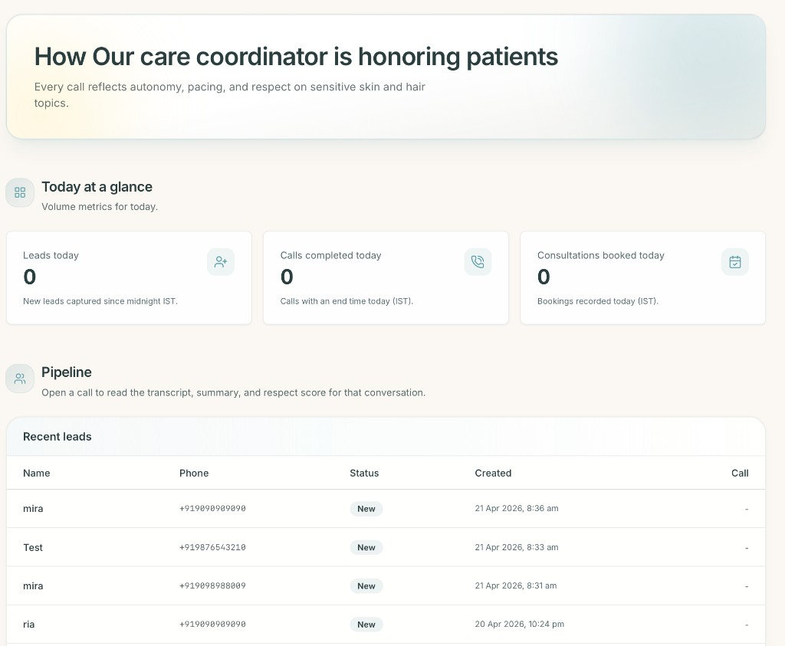

# xyz_clinic Voice Intake

Multilingual AI voice intake and consultation booking platform for dermatology and skin/hair clinics.

Built with Next.js App Router, Supabase, Vapi, Sarvam TTS, Deepgram transcription, and provider-side tools (Google Calendar + Twilio).

## Product Preview


### Dashboard Preview



## What This Project Does

- Public intake form (`/`) for patient name, phone, concern, and preferred language.
- Creates leads in Supabase.
- Supports two call modes:
  - `phone`: triggers outbound Vapi phone call.
  - `web`: starts in-browser voice test call (no PSTN dependency).
- Handles multilingual conversation flow with language-specific prompting and voice settings.
- Supports function-based actions from calls:
  - check slot availability
  - book consultation
  - send WhatsApp info
  - schedule callback
- Dashboard (`/dashboard`) for lead pipeline and call transcript review.

## Core Architecture

- **Frontend**: Next.js + React + Tailwind
- **Backend APIs**: Next.js route handlers in `app/api/*`
- **Database**: Supabase (`leads`, `calls`, `bookings`, `followup_suppressions`)
- **Voice Orchestration**: Vapi
- **LLM**:
  - Phone flow: Anthropic model
  - Web test flow: OpenAI model override
- **STT**: Deepgram
- **TTS**: Sarvam bridge (`/api/sarvam/tts`) with per-language speaker/pace support
- **Integrations**:
  - Google Calendar for booking events
  - Twilio for SMS/WhatsApp notifications

## Key Flows

### 1) Intake -> Lead Creation

1. User submits form on `/`.
2. `POST /api/leads` validates payload.
3. Lead is inserted in Supabase.
4. Depending on mode:
   - `CALL_MODE=phone`: starts Vapi outbound phone call.
   - `CALL_MODE=web`: returns confirmation and enables browser `Test` call.

### 2) Phone Call Mode

- `lib/vapi.ts` sends Vapi call request with prompt, tools, transcriber, and voice config.
- Vapi webhooks are processed by `app/api/vapi/webhook/route.ts`.
- Call lifecycle + transcript + analysis are persisted in `calls`.

### 3) Web Call Mode

- Browser starts call via `@vapi-ai/web`.
- Web call events are persisted through `POST /api/web-calls/events`.
- This enables dashboard call links/transcripts for web test sessions.

### 4) Tool Calls During Conversation

- `check_availability` -> Google Calendar availability
- `book_consultation` -> booking row + calendar event + confirmation message
- `send_whatsapp_info` -> Twilio + optional suppression
- `schedule_callback` -> callback message with suppression checks

## Project Structure

- `app/page.tsx` - public intake page
- `components/LeadForm.tsx` - form UI + web call controls
- `app/dashboard/*` - owner dashboard + call detail
- `app/api/leads/route.ts` - lead intake endpoint
- `app/api/vapi/*` - Vapi webhooks + function routes
- `app/api/sarvam/tts/route.ts` - TTS bridge
- `app/api/web-calls/events/route.ts` - web call persistence events
- `lib/prompts/*` - prompt templates and assembly
- `lib/lead-intake.ts` - lead creation + call trigger logic
- `lib/vapi-function-services.ts` - function-call business actions
- `lib/dashboard-metrics.ts` - dashboard queries

## Setup

### Prerequisites

- Node.js 18+
- npm
- Supabase project + credentials
- Vapi account + phone/web credentials
- Sarvam API key
- (Optional) Twilio + Google Calendar if testing booking/notification actions

### Install

```bash
npm install
```

### Environment

Copy and fill:

```bash
cp .env.local.example .env.local
```

At minimum for local intake + web testing:

- `NEXT_PUBLIC_SUPABASE_URL`
- `SUPABASE_SERVICE_ROLE_KEY`
- `NEXT_PUBLIC_SUPABASE_ANON_KEY`
- `VAPI_API_KEY`
- `VAPI_PHONE_NUMBER_ID` (for phone mode)
- `SARVAM_API_KEY`
- `CLINIC_NAME`
- `CLINIC_CITY`
- `CLINIC_PHONE`
- `NEXT_PUBLIC_BASE_URL`
- `CALL_MODE=web` (or `phone`)
- `NEXT_PUBLIC_VAPI_PUBLIC_KEY`
- `NEXT_PUBLIC_VAPI_ASSISTANT_ID`

Optional web tuning:

- `NEXT_PUBLIC_VAPI_WEB_VOICE_ID`
- `NEXT_PUBLIC_VAPI_WEB_VOICE_MODEL`
- `NEXT_PUBLIC_VAPI_WEB_TRANSCRIBER_MODEL_EN`
- `NEXT_PUBLIC_VAPI_WEB_TRANSCRIBER_MODEL_MULTI`
- `NEXT_PUBLIC_VAPI_WEB_EOT_TIMEOUT_MS`
- `NEXT_PUBLIC_VAPI_WEB_EOT_THRESHOLD`

Optional Sarvam per-language tuning:

- `SARVAM_SPEAKER_ML_IN`, `SARVAM_PACE_ML_IN`
- `SARVAM_SPEAKER_TA_IN`, `SARVAM_PACE_TA_IN`
- `SARVAM_SPEAKER_TE_IN`, `SARVAM_PACE_TE_IN`
- `SARVAM_SPEAKER_KN_IN`, `SARVAM_PACE_KN_IN`
- `SARVAM_SPEAKER_HI_IN`, `SARVAM_PACE_HI_IN`

## Run Locally

```bash
npm run dev
```

Open `http://localhost:3000`.

## Verification Commands

```bash
npm run lint
npm run build
```

## Dashboard Notes

- Pipeline rows come from `leads`.
- `Call` link appears only when a `calls` row exists.
- For web test calls, events must be persisted through `/api/web-calls/events` for transcript visibility.

## Common Troubleshooting

- **“Could not start browser call”**  
  Verify `NEXT_PUBLIC_VAPI_PUBLIC_KEY`, `NEXT_PUBLIC_VAPI_ASSISTANT_ID`, and browser mic permissions.

- **Call starts then “Meeting has ended / ejected”**  
  Usually Vapi assistant/runtime configuration issue. Validate assistant publish state and web-compatible config.

- **Lead created but no transcript in dashboard**  
  Ensure web call events are reaching `/api/web-calls/events` and `calls` rows are being written.

- **Phone call trial whisper / press key behavior**  
  Telephony trial provider behavior (external account setting), not app UI logic.

## Tech Scripts

- `npm run dev` - local development
- `npm run build` - production build
- `npm run start` - run built app
- `npm run lint` - lint checks


<svg width="100%" viewBox="0 0 680 860" role="img" style="" xmlns="http://www.w3.org/2000/svg">
<title style="fill:rgb(0, 0, 0);stroke:none;color:rgb(255, 255, 255);stroke-width:1px;stroke-linecap:butt;stroke-linejoin:miter;opacity:1;font-family:&quot;Anthropic Sans&quot;, -apple-system, BlinkMacSystemFont, &quot;Segoe UI&quot;, sans-serif;font-size:16px;font-weight:400;text-anchor:start;dominant-baseline:auto">EmpathyFlow call flow</title>
<desc style="fill:rgb(0, 0, 0);stroke:none;color:rgb(255, 255, 255);stroke-width:1px;stroke-linecap:butt;stroke-linejoin:miter;opacity:1;font-family:&quot;Anthropic Sans&quot;, -apple-system, BlinkMacSystemFont, &quot;Segoe UI&quot;, sans-serif;font-size:16px;font-weight:400;text-anchor:start;dominant-baseline:auto">Step by step flowchart of the EmpathyFlow voice pipeline from patient intake to post-call analysis</desc>
<defs>
<marker id="arrow" viewBox="0 0 10 10" refX="8" refY="5" markerWidth="6" markerHeight="6" orient="auto-start-reverse">
<path d="M2 1L8 5L2 9" fill="none" stroke="context-stroke" stroke-width="1.5" stroke-linecap="round" stroke-linejoin="round"/>
</marker>
<mask id="imagine-text-gaps-fv59vf" maskUnits="userSpaceOnUse"><rect x="0" y="0" width="680" height="860" fill="white"/><rect x="258.015625" y="29.234375" width="163.96875" height="21.53125" fill="black" rx="2"/><rect x="245.828125" y="48.484375" width="188.34375" height="19.03125" fill="black" rx="2"/><rect x="299.109375" y="119.234375" width="81.78125" height="21.53125" fill="black" rx="2"/><rect x="232.9375" y="138.484375" width="214.125" height="19.03125" fill="black" rx="2"/><rect x="273.84375" y="209.234375" width="132.3125" height="21.515625" fill="black" rx="2"/><rect x="264.09375" y="228.484375" width="151.8125" height="19.03125" fill="black" rx="2"/><rect x="287.453125" y="299.25" width="105.09375" height="21.515625" fill="black" rx="2"/><rect x="234.125" y="318.484375" width="211.75" height="19.015625" fill="black" rx="2"/><rect x="296.109375" y="389.25" width="87.78125" height="21.515625" fill="black" rx="2"/><rect x="222.984375" y="408.484375" width="234.03125" height="19.015625" fill="black" rx="2"/><rect x="535.390625" y="493.25" width="69.21875" height="21.515625" fill="black" rx="2"/><rect x="483.03125" y="512.5" width="173.9375" height="19" fill="black" rx="2"/><rect x="265.359375" y="479.25" width="149.28125" height="21.515625" fill="black" rx="2"/><rect x="225.359375" y="498.5" width="229.28125" height="19" fill="black" rx="2"/><rect x="70.4375" y="349.078125" width="39.125" height="19.015625" fill="black" rx="2"/><rect x="73.765625" y="361.078125" width="32.46875" height="19.015625" fill="black" rx="2"/><rect x="248.96875" y="569.25" width="182.0625" height="21.515625" fill="black" rx="2"/><rect x="246.546875" y="588.5" width="186.90625" height="19" fill="black" rx="2"/><rect x="253.390625" y="659.25" width="173.21875" height="21.515625" fill="black" rx="2"/><rect x="255.34375" y="678.5" width="169.3125" height="19" fill="black" rx="2"/><rect x="259.390625" y="749.25" width="161.21875" height="21.515625" fill="black" rx="2"/><rect x="240.34375" y="768.5" width="199.3125" height="19" fill="black" rx="2"/></mask></defs>

<g style="fill:rgb(0, 0, 0);stroke:none;color:rgb(255, 255, 255);stroke-width:1px;stroke-linecap:butt;stroke-linejoin:miter;opacity:1;font-family:&quot;Anthropic Sans&quot;, -apple-system, BlinkMacSystemFont, &quot;Segoe UI&quot;, sans-serif;font-size:16px;font-weight:400;text-anchor:start;dominant-baseline:auto">
<rect x="190" y="20" width="300" height="56" rx="8" stroke-width="0.5" style="fill:rgb(68, 68, 65);stroke:rgb(180, 178, 169);color:rgb(255, 255, 255);stroke-width:0.5px;stroke-linecap:butt;stroke-linejoin:miter;opacity:1;font-family:&quot;Anthropic Sans&quot;, -apple-system, BlinkMacSystemFont, &quot;Segoe UI&quot;, sans-serif;font-size:16px;font-weight:400;text-anchor:start;dominant-baseline:auto"/>
<text x="340" y="40" text-anchor="middle" dominant-baseline="central" style="fill:rgb(211, 209, 199);stroke:none;color:rgb(255, 255, 255);stroke-width:1px;stroke-linecap:butt;stroke-linejoin:miter;opacity:1;font-family:&quot;Anthropic Sans&quot;, -apple-system, BlinkMacSystemFont, &quot;Segoe UI&quot;, sans-serif;font-size:14px;font-weight:500;text-anchor:middle;dominant-baseline:central">Patient fills intake form</text>
<text x="340" y="58" text-anchor="middle" dominant-baseline="central" style="fill:rgb(180, 178, 169);stroke:none;color:rgb(255, 255, 255);stroke-width:1px;stroke-linecap:butt;stroke-linejoin:miter;opacity:1;font-family:&quot;Anthropic Sans&quot;, -apple-system, BlinkMacSystemFont, &quot;Segoe UI&quot;, sans-serif;font-size:12px;font-weight:400;text-anchor:middle;dominant-baseline:central">name, phone, concern, language</text>
</g>

<line x1="340" y1="76" x2="340" y2="110" marker-end="url(#arrow)" style="fill:none;stroke:rgb(156, 154, 146);color:rgb(255, 255, 255);stroke-width:1.5px;stroke-linecap:butt;stroke-linejoin:miter;opacity:1;font-family:&quot;Anthropic Sans&quot;, -apple-system, BlinkMacSystemFont, &quot;Segoe UI&quot;, sans-serif;font-size:16px;font-weight:400;text-anchor:start;dominant-baseline:auto"/>

<g style="fill:rgb(0, 0, 0);stroke:none;color:rgb(255, 255, 255);stroke-width:1px;stroke-linecap:butt;stroke-linejoin:miter;opacity:1;font-family:&quot;Anthropic Sans&quot;, -apple-system, BlinkMacSystemFont, &quot;Segoe UI&quot;, sans-serif;font-size:16px;font-weight:400;text-anchor:start;dominant-baseline:auto">
<rect x="190" y="110" width="300" height="56" rx="8" stroke-width="0.5" style="fill:rgb(60, 52, 137);stroke:rgb(175, 169, 236);color:rgb(255, 255, 255);stroke-width:0.5px;stroke-linecap:butt;stroke-linejoin:miter;opacity:1;font-family:&quot;Anthropic Sans&quot;, -apple-system, BlinkMacSystemFont, &quot;Segoe UI&quot;, sans-serif;font-size:16px;font-weight:400;text-anchor:start;dominant-baseline:auto"/>
<text x="340" y="130" text-anchor="middle" dominant-baseline="central" style="fill:rgb(206, 203, 246);stroke:none;color:rgb(255, 255, 255);stroke-width:1px;stroke-linecap:butt;stroke-linejoin:miter;opacity:1;font-family:&quot;Anthropic Sans&quot;, -apple-system, BlinkMacSystemFont, &quot;Segoe UI&quot;, sans-serif;font-size:14px;font-weight:500;text-anchor:middle;dominant-baseline:central">Next.js API</text>
<text x="340" y="148" text-anchor="middle" dominant-baseline="central" style="fill:rgb(175, 169, 236);stroke:none;color:rgb(255, 255, 255);stroke-width:1px;stroke-linecap:butt;stroke-linejoin:miter;opacity:1;font-family:&quot;Anthropic Sans&quot;, -apple-system, BlinkMacSystemFont, &quot;Segoe UI&quot;, sans-serif;font-size:12px;font-weight:400;text-anchor:middle;dominant-baseline:central">create lead in Supabase, trigger Vapi</text>
</g>

<line x1="340" y1="166" x2="340" y2="200" marker-end="url(#arrow)" style="fill:none;stroke:rgb(156, 154, 146);color:rgb(255, 255, 255);stroke-width:1.5px;stroke-linecap:butt;stroke-linejoin:miter;opacity:1;font-family:&quot;Anthropic Sans&quot;, -apple-system, BlinkMacSystemFont, &quot;Segoe UI&quot;, sans-serif;font-size:16px;font-weight:400;text-anchor:start;dominant-baseline:auto"/>

<g style="fill:rgb(0, 0, 0);stroke:none;color:rgb(255, 255, 255);stroke-width:1px;stroke-linecap:butt;stroke-linejoin:miter;opacity:1;font-family:&quot;Anthropic Sans&quot;, -apple-system, BlinkMacSystemFont, &quot;Segoe UI&quot;, sans-serif;font-size:16px;font-weight:400;text-anchor:start;dominant-baseline:auto">
<rect x="190" y="200" width="300" height="56" rx="8" stroke-width="0.5" style="fill:rgb(60, 52, 137);stroke:rgb(175, 169, 236);color:rgb(255, 255, 255);stroke-width:0.5px;stroke-linecap:butt;stroke-linejoin:miter;opacity:1;font-family:&quot;Anthropic Sans&quot;, -apple-system, BlinkMacSystemFont, &quot;Segoe UI&quot;, sans-serif;font-size:16px;font-weight:400;text-anchor:start;dominant-baseline:auto"/>
<text x="340" y="220" text-anchor="middle" dominant-baseline="central" style="fill:rgb(206, 203, 246);stroke:none;color:rgb(255, 255, 255);stroke-width:1px;stroke-linecap:butt;stroke-linejoin:miter;opacity:1;font-family:&quot;Anthropic Sans&quot;, -apple-system, BlinkMacSystemFont, &quot;Segoe UI&quot;, sans-serif;font-size:14px;font-weight:500;text-anchor:middle;dominant-baseline:central">Vapi outbound call</text>
<text x="340" y="238" text-anchor="middle" dominant-baseline="central" style="fill:rgb(175, 169, 236);stroke:none;color:rgb(255, 255, 255);stroke-width:1px;stroke-linecap:butt;stroke-linejoin:miter;opacity:1;font-family:&quot;Anthropic Sans&quot;, -apple-system, BlinkMacSystemFont, &quot;Segoe UI&quot;, sans-serif;font-size:12px;font-weight:400;text-anchor:middle;dominant-baseline:central">manages full call lifecycle</text>
</g>

<line x1="340" y1="256" x2="340" y2="290" marker-end="url(#arrow)" style="fill:none;stroke:rgb(156, 154, 146);color:rgb(255, 255, 255);stroke-width:1.5px;stroke-linecap:butt;stroke-linejoin:miter;opacity:1;font-family:&quot;Anthropic Sans&quot;, -apple-system, BlinkMacSystemFont, &quot;Segoe UI&quot;, sans-serif;font-size:16px;font-weight:400;text-anchor:start;dominant-baseline:auto"/>

<g style="fill:rgb(0, 0, 0);stroke:none;color:rgb(255, 255, 255);stroke-width:1px;stroke-linecap:butt;stroke-linejoin:miter;opacity:1;font-family:&quot;Anthropic Sans&quot;, -apple-system, BlinkMacSystemFont, &quot;Segoe UI&quot;, sans-serif;font-size:16px;font-weight:400;text-anchor:start;dominant-baseline:auto">
<rect x="190" y="290" width="300" height="56" rx="8" stroke-width="0.5" style="fill:rgb(8, 80, 65);stroke:rgb(93, 202, 165);color:rgb(255, 255, 255);stroke-width:0.5px;stroke-linecap:butt;stroke-linejoin:miter;opacity:1;font-family:&quot;Anthropic Sans&quot;, -apple-system, BlinkMacSystemFont, &quot;Segoe UI&quot;, sans-serif;font-size:16px;font-weight:400;text-anchor:start;dominant-baseline:auto"/>
<text x="340" y="310" text-anchor="middle" dominant-baseline="central" style="fill:rgb(159, 225, 203);stroke:none;color:rgb(255, 255, 255);stroke-width:1px;stroke-linecap:butt;stroke-linejoin:miter;opacity:1;font-family:&quot;Anthropic Sans&quot;, -apple-system, BlinkMacSystemFont, &quot;Segoe UI&quot;, sans-serif;font-size:14px;font-weight:500;text-anchor:middle;dominant-baseline:central">Deepgram STT</text>
<text x="340" y="328" text-anchor="middle" dominant-baseline="central" style="fill:rgb(93, 202, 165);stroke:none;color:rgb(255, 255, 255);stroke-width:1px;stroke-linecap:butt;stroke-linejoin:miter;opacity:1;font-family:&quot;Anthropic Sans&quot;, -apple-system, BlinkMacSystemFont, &quot;Segoe UI&quot;, sans-serif;font-size:12px;font-weight:400;text-anchor:middle;dominant-baseline:central">nova-2 (EN) / flux-general-multi (IN)</text>
</g>

<line x1="340" y1="346" x2="340" y2="380" marker-end="url(#arrow)" style="fill:none;stroke:rgb(156, 154, 146);color:rgb(255, 255, 255);stroke-width:1.5px;stroke-linecap:butt;stroke-linejoin:miter;opacity:1;font-family:&quot;Anthropic Sans&quot;, -apple-system, BlinkMacSystemFont, &quot;Segoe UI&quot;, sans-serif;font-size:16px;font-weight:400;text-anchor:start;dominant-baseline:auto"/>

<g style="fill:rgb(0, 0, 0);stroke:none;color:rgb(255, 255, 255);stroke-width:1px;stroke-linecap:butt;stroke-linejoin:miter;opacity:1;font-family:&quot;Anthropic Sans&quot;, -apple-system, BlinkMacSystemFont, &quot;Segoe UI&quot;, sans-serif;font-size:16px;font-weight:400;text-anchor:start;dominant-baseline:auto">
<rect x="190" y="380" width="300" height="56" rx="8" stroke-width="0.5" style="fill:rgb(99, 56, 6);stroke:rgb(239, 159, 39);color:rgb(255, 255, 255);stroke-width:0.5px;stroke-linecap:butt;stroke-linejoin:miter;opacity:1;font-family:&quot;Anthropic Sans&quot;, -apple-system, BlinkMacSystemFont, &quot;Segoe UI&quot;, sans-serif;font-size:16px;font-weight:400;text-anchor:start;dominant-baseline:auto"/>
<text x="340" y="400" text-anchor="middle" dominant-baseline="central" style="fill:rgb(250, 199, 117);stroke:none;color:rgb(255, 255, 255);stroke-width:1px;stroke-linecap:butt;stroke-linejoin:miter;opacity:1;font-family:&quot;Anthropic Sans&quot;, -apple-system, BlinkMacSystemFont, &quot;Segoe UI&quot;, sans-serif;font-size:14px;font-weight:500;text-anchor:middle;dominant-baseline:central">Claude LLM</text>
<text x="340" y="418" text-anchor="middle" dominant-baseline="central" style="fill:rgb(239, 159, 39);stroke:none;color:rgb(255, 255, 255);stroke-width:1px;stroke-linecap:butt;stroke-linejoin:miter;opacity:1;font-family:&quot;Anthropic Sans&quot;, -apple-system, BlinkMacSystemFont, &quot;Segoe UI&quot;, sans-serif;font-size:12px;font-weight:400;text-anchor:middle;dominant-baseline:central">understands concern, decides response</text>
</g>

<path d="M490 408 L560 408 L560 510 L490 510" fill="none" stroke="#BA7517" stroke-width="1" marker-end="url(#arrow)" mask="url(#imagine-text-gaps-fv59vf)" style="fill:none;stroke:rgb(186, 117, 23);color:rgb(255, 255, 255);stroke-width:1px;stroke-linecap:butt;stroke-linejoin:miter;opacity:1;font-family:&quot;Anthropic Sans&quot;, -apple-system, BlinkMacSystemFont, &quot;Segoe UI&quot;, sans-serif;font-size:16px;font-weight:400;text-anchor:start;dominant-baseline:auto"/>
<g style="fill:rgb(0, 0, 0);stroke:none;color:rgb(255, 255, 255);stroke-width:1px;stroke-linecap:butt;stroke-linejoin:miter;opacity:1;font-family:&quot;Anthropic Sans&quot;, -apple-system, BlinkMacSystemFont, &quot;Segoe UI&quot;, sans-serif;font-size:16px;font-weight:400;text-anchor:start;dominant-baseline:auto">
<rect x="490" y="484" width="160" height="56" rx="8" stroke-width="0.5" style="fill:rgb(99, 56, 6);stroke:rgb(239, 159, 39);color:rgb(255, 255, 255);stroke-width:0.5px;stroke-linecap:butt;stroke-linejoin:miter;opacity:1;font-family:&quot;Anthropic Sans&quot;, -apple-system, BlinkMacSystemFont, &quot;Segoe UI&quot;, sans-serif;font-size:16px;font-weight:400;text-anchor:start;dominant-baseline:auto"/>
<text x="570" y="504" text-anchor="middle" dominant-baseline="central" style="fill:rgb(250, 199, 117);stroke:none;color:rgb(255, 255, 255);stroke-width:1px;stroke-linecap:butt;stroke-linejoin:miter;opacity:1;font-family:&quot;Anthropic Sans&quot;, -apple-system, BlinkMacSystemFont, &quot;Segoe UI&quot;, sans-serif;font-size:14px;font-weight:500;text-anchor:middle;dominant-baseline:central">Tool calls</text>
<text x="570" y="522" text-anchor="middle" dominant-baseline="central" style="fill:rgb(239, 159, 39);stroke:none;color:rgb(255, 255, 255);stroke-width:1px;stroke-linecap:butt;stroke-linejoin:miter;opacity:1;font-family:&quot;Anthropic Sans&quot;, -apple-system, BlinkMacSystemFont, &quot;Segoe UI&quot;, sans-serif;font-size:12px;font-weight:400;text-anchor:middle;dominant-baseline:central">calendar, booking, WhatsApp</text>
</g>
<path d="M490 512 L470 512 L470 436 L490 436" fill="none" stroke="#BA7517" stroke-width="1" marker-end="url(#arrow)" style="fill:none;stroke:rgb(186, 117, 23);color:rgb(255, 255, 255);stroke-width:1px;stroke-linecap:butt;stroke-linejoin:miter;opacity:1;font-family:&quot;Anthropic Sans&quot;, -apple-system, BlinkMacSystemFont, &quot;Segoe UI&quot;, sans-serif;font-size:16px;font-weight:400;text-anchor:start;dominant-baseline:auto"/>

<line x1="340" y1="436" x2="340" y2="470" marker-end="url(#arrow)" style="fill:none;stroke:rgb(156, 154, 146);color:rgb(255, 255, 255);stroke-width:1.5px;stroke-linecap:butt;stroke-linejoin:miter;opacity:1;font-family:&quot;Anthropic Sans&quot;, -apple-system, BlinkMacSystemFont, &quot;Segoe UI&quot;, sans-serif;font-size:16px;font-weight:400;text-anchor:start;dominant-baseline:auto"/>

<g style="fill:rgb(0, 0, 0);stroke:none;color:rgb(255, 255, 255);stroke-width:1px;stroke-linecap:butt;stroke-linejoin:miter;opacity:1;font-family:&quot;Anthropic Sans&quot;, -apple-system, BlinkMacSystemFont, &quot;Segoe UI&quot;, sans-serif;font-size:16px;font-weight:400;text-anchor:start;dominant-baseline:auto">
<rect x="190" y="470" width="300" height="56" rx="8" stroke-width="0.5" style="fill:rgb(8, 80, 65);stroke:rgb(93, 202, 165);color:rgb(255, 255, 255);stroke-width:0.5px;stroke-linecap:butt;stroke-linejoin:miter;opacity:1;font-family:&quot;Anthropic Sans&quot;, -apple-system, BlinkMacSystemFont, &quot;Segoe UI&quot;, sans-serif;font-size:16px;font-weight:400;text-anchor:start;dominant-baseline:auto"/>
<text x="340" y="490" text-anchor="middle" dominant-baseline="central" style="fill:rgb(159, 225, 203);stroke:none;color:rgb(255, 255, 255);stroke-width:1px;stroke-linecap:butt;stroke-linejoin:miter;opacity:1;font-family:&quot;Anthropic Sans&quot;, -apple-system, BlinkMacSystemFont, &quot;Segoe UI&quot;, sans-serif;font-size:14px;font-weight:500;text-anchor:middle;dominant-baseline:central">Sarvam Bulbul v3 TTS</text>
<text x="340" y="508" text-anchor="middle" dominant-baseline="central" style="fill:rgb(93, 202, 165);stroke:none;color:rgb(255, 255, 255);stroke-width:1px;stroke-linecap:butt;stroke-linejoin:miter;opacity:1;font-family:&quot;Anthropic Sans&quot;, -apple-system, BlinkMacSystemFont, &quot;Segoe UI&quot;, sans-serif;font-size:12px;font-weight:400;text-anchor:middle;dominant-baseline:central">text → WAV audio in patient's language</text>
</g>

<path d="M190 498 L130 498 L130 228 L190 228" fill="none" stroke="#0F6E56" stroke-width="1" stroke-dasharray="5 4" marker-end="url(#arrow)" style="fill:none;stroke:rgb(15, 110, 86);color:rgb(255, 255, 255);stroke-width:1px;stroke-dasharray:5px, 4px;stroke-linecap:butt;stroke-linejoin:miter;opacity:1;font-family:&quot;Anthropic Sans&quot;, -apple-system, BlinkMacSystemFont, &quot;Segoe UI&quot;, sans-serif;font-size:16px;font-weight:400;text-anchor:start;dominant-baseline:auto"/>
<text x="90" y="363" text-anchor="middle" style="fill:rgb(194, 192, 182);stroke:none;color:rgb(255, 255, 255);stroke-width:1px;stroke-linecap:butt;stroke-linejoin:miter;opacity:1;font-family:&quot;Anthropic Sans&quot;, -apple-system, BlinkMacSystemFont, &quot;Segoe UI&quot;, sans-serif;font-size:12px;font-weight:400;text-anchor:middle;dominant-baseline:auto">audio</text>
<text x="90" y="375" text-anchor="middle" style="fill:rgb(194, 192, 182);stroke:none;color:rgb(255, 255, 255);stroke-width:1px;stroke-linecap:butt;stroke-linejoin:miter;opacity:1;font-family:&quot;Anthropic Sans&quot;, -apple-system, BlinkMacSystemFont, &quot;Segoe UI&quot;, sans-serif;font-size:12px;font-weight:400;text-anchor:middle;dominant-baseline:auto">loop</text>

<line x1="340" y1="526" x2="340" y2="560" marker-end="url(#arrow)" style="fill:none;stroke:rgb(156, 154, 146);color:rgb(255, 255, 255);stroke-width:1.5px;stroke-linecap:butt;stroke-linejoin:miter;opacity:1;font-family:&quot;Anthropic Sans&quot;, -apple-system, BlinkMacSystemFont, &quot;Segoe UI&quot;, sans-serif;font-size:16px;font-weight:400;text-anchor:start;dominant-baseline:auto"/>

<g style="fill:rgb(0, 0, 0);stroke:none;color:rgb(255, 255, 255);stroke-width:1px;stroke-linecap:butt;stroke-linejoin:miter;opacity:1;font-family:&quot;Anthropic Sans&quot;, -apple-system, BlinkMacSystemFont, &quot;Segoe UI&quot;, sans-serif;font-size:16px;font-weight:400;text-anchor:start;dominant-baseline:auto">
<rect x="190" y="560" width="300" height="56" rx="8" stroke-width="0.5" style="fill:rgb(68, 68, 65);stroke:rgb(180, 178, 169);color:rgb(255, 255, 255);stroke-width:0.5px;stroke-linecap:butt;stroke-linejoin:miter;opacity:1;font-family:&quot;Anthropic Sans&quot;, -apple-system, BlinkMacSystemFont, &quot;Segoe UI&quot;, sans-serif;font-size:16px;font-weight:400;text-anchor:start;dominant-baseline:auto"/>
<text x="340" y="580" text-anchor="middle" dominant-baseline="central" style="fill:rgb(211, 209, 199);stroke:none;color:rgb(255, 255, 255);stroke-width:1px;stroke-linecap:butt;stroke-linejoin:miter;opacity:1;font-family:&quot;Anthropic Sans&quot;, -apple-system, BlinkMacSystemFont, &quot;Segoe UI&quot;, sans-serif;font-size:14px;font-weight:500;text-anchor:middle;dominant-baseline:central">Call ends → webhook fires</text>
<text x="340" y="598" text-anchor="middle" dominant-baseline="central" style="fill:rgb(180, 178, 169);stroke:none;color:rgb(255, 255, 255);stroke-width:1px;stroke-linecap:butt;stroke-linejoin:miter;opacity:1;font-family:&quot;Anthropic Sans&quot;, -apple-system, BlinkMacSystemFont, &quot;Segoe UI&quot;, sans-serif;font-size:12px;font-weight:400;text-anchor:middle;dominant-baseline:central">Vapi sends transcript to Next.js</text>
</g>

<line x1="340" y1="616" x2="340" y2="650" marker-end="url(#arrow)" style="fill:none;stroke:rgb(156, 154, 146);color:rgb(255, 255, 255);stroke-width:1.5px;stroke-linecap:butt;stroke-linejoin:miter;opacity:1;font-family:&quot;Anthropic Sans&quot;, -apple-system, BlinkMacSystemFont, &quot;Segoe UI&quot;, sans-serif;font-size:16px;font-weight:400;text-anchor:start;dominant-baseline:auto"/>

<g style="fill:rgb(0, 0, 0);stroke:none;color:rgb(255, 255, 255);stroke-width:1px;stroke-linecap:butt;stroke-linejoin:miter;opacity:1;font-family:&quot;Anthropic Sans&quot;, -apple-system, BlinkMacSystemFont, &quot;Segoe UI&quot;, sans-serif;font-size:16px;font-weight:400;text-anchor:start;dominant-baseline:auto">
<rect x="190" y="650" width="300" height="56" rx="8" stroke-width="0.5" style="fill:rgb(99, 56, 6);stroke:rgb(239, 159, 39);color:rgb(255, 255, 255);stroke-width:0.5px;stroke-linecap:butt;stroke-linejoin:miter;opacity:1;font-family:&quot;Anthropic Sans&quot;, -apple-system, BlinkMacSystemFont, &quot;Segoe UI&quot;, sans-serif;font-size:16px;font-weight:400;text-anchor:start;dominant-baseline:auto"/>
<text x="340" y="670" text-anchor="middle" dominant-baseline="central" style="fill:rgb(250, 199, 117);stroke:none;color:rgb(255, 255, 255);stroke-width:1px;stroke-linecap:butt;stroke-linejoin:miter;opacity:1;font-family:&quot;Anthropic Sans&quot;, -apple-system, BlinkMacSystemFont, &quot;Segoe UI&quot;, sans-serif;font-size:14px;font-weight:500;text-anchor:middle;dominant-baseline:central">Claude post-call analysis</text>
<text x="340" y="688" text-anchor="middle" dominant-baseline="central" style="fill:rgb(239, 159, 39);stroke:none;color:rgb(255, 255, 255);stroke-width:1px;stroke-linecap:butt;stroke-linejoin:miter;opacity:1;font-family:&quot;Anthropic Sans&quot;, -apple-system, BlinkMacSystemFont, &quot;Segoe UI&quot;, sans-serif;font-size:12px;font-weight:400;text-anchor:middle;dominant-baseline:central">summary + respect score 1-5</text>
</g>

<line x1="340" y1="706" x2="340" y2="740" marker-end="url(#arrow)" style="fill:none;stroke:rgb(156, 154, 146);color:rgb(255, 255, 255);stroke-width:1.5px;stroke-linecap:butt;stroke-linejoin:miter;opacity:1;font-family:&quot;Anthropic Sans&quot;, -apple-system, BlinkMacSystemFont, &quot;Segoe UI&quot;, sans-serif;font-size:16px;font-weight:400;text-anchor:start;dominant-baseline:auto"/>

<g style="fill:rgb(0, 0, 0);stroke:none;color:rgb(255, 255, 255);stroke-width:1px;stroke-linecap:butt;stroke-linejoin:miter;opacity:1;font-family:&quot;Anthropic Sans&quot;, -apple-system, BlinkMacSystemFont, &quot;Segoe UI&quot;, sans-serif;font-size:16px;font-weight:400;text-anchor:start;dominant-baseline:auto">
<rect x="190" y="740" width="300" height="56" rx="8" stroke-width="0.5" style="fill:rgb(8, 80, 65);stroke:rgb(93, 202, 165);color:rgb(255, 255, 255);stroke-width:0.5px;stroke-linecap:butt;stroke-linejoin:miter;opacity:1;font-family:&quot;Anthropic Sans&quot;, -apple-system, BlinkMacSystemFont, &quot;Segoe UI&quot;, sans-serif;font-size:16px;font-weight:400;text-anchor:start;dominant-baseline:auto"/>
<text x="340" y="760" text-anchor="middle" dominant-baseline="central" style="fill:rgb(159, 225, 203);stroke:none;color:rgb(255, 255, 255);stroke-width:1px;stroke-linecap:butt;stroke-linejoin:miter;opacity:1;font-family:&quot;Anthropic Sans&quot;, -apple-system, BlinkMacSystemFont, &quot;Segoe UI&quot;, sans-serif;font-size:14px;font-weight:500;text-anchor:middle;dominant-baseline:central">Supabase + Dashboard</text>
<text x="340" y="778" text-anchor="middle" dominant-baseline="central" style="fill:rgb(93, 202, 165);stroke:none;color:rgb(255, 255, 255);stroke-width:1px;stroke-linecap:butt;stroke-linejoin:miter;opacity:1;font-family:&quot;Anthropic Sans&quot;, -apple-system, BlinkMacSystemFont, &quot;Segoe UI&quot;, sans-serif;font-size:12px;font-weight:400;text-anchor:middle;dominant-baseline:central">transcript, score, summary stored</text>
</g>

</svg>


## License

Private internal project (see repository policy).
