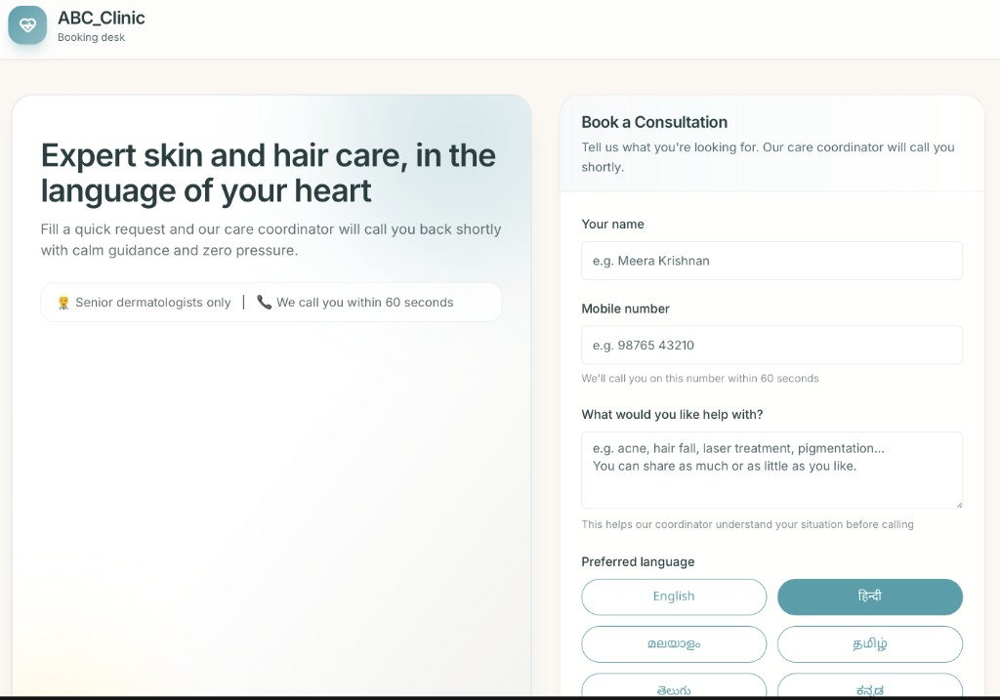

# xyz_clinic Voice Intake

Voice-first patient intake, follow-up, and booking workflow for dermatology / skin & hair clinics.

Built with Next.js App Router, Supabase, Vapi, Sarvam TTS, Deepgram transcription, and provider-side tools (Google Calendar + Twilio).

## Product Preview



## What This Project Does

- Public intake form (`/`) for patient name, phone, concern, and preferred language.
- Creates leads in Supabase.
- Supports two call modes:
  - `phone`: triggers outbound Vapi phone call.
  - `web`: starts in-browser voice test call (no PSTN dependency).
- Handles multilingual conversation flow with language-specific prompting and voice settings.
- Supports function-based actions from calls:
  - check slot availability
  - book consultation
  - send WhatsApp info
  - schedule callback
- Dashboard (`/dashboard`) for lead pipeline and call transcript review.

## Core Architecture

- **Frontend**: Next.js + React + Tailwind
- **Backend APIs**: Next.js route handlers in `app/api/*`
- **Database**: Supabase (`leads`, `calls`, `bookings`, `followup_suppressions`)
- **Voice Orchestration**: Vapi
- **LLM**:
  - Phone flow: Anthropic model
  - Web test flow: OpenAI model override
- **STT**: Deepgram
- **TTS**: Sarvam bridge (`/api/sarvam/tts`) with per-language speaker/pace support
- **Integrations**:
  - Google Calendar for booking events
  - Twilio for SMS/WhatsApp notifications

## Key Flows

### 1) Intake -> Lead Creation

1. User submits form on `/`.
2. `POST /api/leads` validates payload.
3. Lead is inserted in Supabase.
4. Depending on mode:
   - `CALL_MODE=phone`: starts Vapi outbound phone call.
   - `CALL_MODE=web`: returns confirmation and enables browser `Test` call.

### 2) Phone Call Mode

- `lib/vapi.ts` sends Vapi call request with prompt, tools, transcriber, and voice config.
- Vapi webhooks are processed by `app/api/vapi/webhook/route.ts`.
- Call lifecycle + transcript + analysis are persisted in `calls`.

### 3) Web Call Mode

- Browser starts call via `@vapi-ai/web`.
- Web call events are persisted through `POST /api/web-calls/events`.
- This enables dashboard call links/transcripts for web test sessions.

### 4) Tool Calls During Conversation

- `check_availability` -> Google Calendar availability
- `book_consultation` -> booking row + calendar event + confirmation message
- `send_whatsapp_info` -> Twilio + optional suppression
- `schedule_callback` -> callback message with suppression checks

## Project Structure

- `app/page.tsx` - public intake page
- `components/LeadForm.tsx` - form UI + web call controls
- `app/dashboard/*` - owner dashboard + call detail
- `app/api/leads/route.ts` - lead intake endpoint
- `app/api/vapi/*` - Vapi webhooks + function routes
- `app/api/sarvam/tts/route.ts` - TTS bridge
- `app/api/web-calls/events/route.ts` - web call persistence events
- `lib/prompts/*` - prompt templates and assembly
- `lib/lead-intake.ts` - lead creation + call trigger logic
- `lib/vapi-function-services.ts` - function-call business actions
- `lib/dashboard-metrics.ts` - dashboard queries

## Setup

### Prerequisites

- Node.js 18+
- npm
- Supabase project + credentials
- Vapi account + phone/web credentials
- Sarvam API key
- (Optional) Twilio + Google Calendar if testing booking/notification actions

### Install

```bash
npm install
```

### Environment

Copy and fill:

```bash
cp .env.local.example .env.local
```

At minimum for local intake + web testing:

- `NEXT_PUBLIC_SUPABASE_URL`
- `SUPABASE_SERVICE_ROLE_KEY`
- `NEXT_PUBLIC_SUPABASE_ANON_KEY`
- `VAPI_API_KEY`
- `VAPI_PHONE_NUMBER_ID` (for phone mode)
- `SARVAM_API_KEY`
- `CLINIC_NAME`
- `CLINIC_CITY`
- `CLINIC_PHONE`
- `NEXT_PUBLIC_BASE_URL`
- `CALL_MODE=web` (or `phone`)
- `NEXT_PUBLIC_VAPI_PUBLIC_KEY`
- `NEXT_PUBLIC_VAPI_ASSISTANT_ID`

Optional web tuning:

- `NEXT_PUBLIC_VAPI_WEB_VOICE_ID`
- `NEXT_PUBLIC_VAPI_WEB_VOICE_MODEL`
- `NEXT_PUBLIC_VAPI_WEB_TRANSCRIBER_MODEL_EN`
- `NEXT_PUBLIC_VAPI_WEB_TRANSCRIBER_MODEL_MULTI`
- `NEXT_PUBLIC_VAPI_WEB_EOT_TIMEOUT_MS`
- `NEXT_PUBLIC_VAPI_WEB_EOT_THRESHOLD`

Optional Sarvam per-language tuning:

- `SARVAM_SPEAKER_ML_IN`, `SARVAM_PACE_ML_IN`
- `SARVAM_SPEAKER_TA_IN`, `SARVAM_PACE_TA_IN`
- `SARVAM_SPEAKER_TE_IN`, `SARVAM_PACE_TE_IN`
- `SARVAM_SPEAKER_KN_IN`, `SARVAM_PACE_KN_IN`
- `SARVAM_SPEAKER_HI_IN`, `SARVAM_PACE_HI_IN`

## Run Locally

```bash
npm run dev
```

Open `http://localhost:3000`.

## Verification Commands

```bash
npm run lint
npm run build
```

## Dashboard Notes

- Pipeline rows come from `leads`.
- `Call` link appears only when a `calls` row exists.
- For web test calls, events must be persisted through `/api/web-calls/events` for transcript visibility.

## Common Troubleshooting

- **“Could not start browser call”**  
  Verify `NEXT_PUBLIC_VAPI_PUBLIC_KEY`, `NEXT_PUBLIC_VAPI_ASSISTANT_ID`, and browser mic permissions.

- **Call starts then “Meeting has ended / ejected”**  
  Usually Vapi assistant/runtime configuration issue. Validate assistant publish state and web-compatible config.

- **Lead created but no transcript in dashboard**  
  Ensure web call events are reaching `/api/web-calls/events` and `calls` rows are being written.

- **Phone call trial whisper / press key behavior**  
  Telephony trial provider behavior (external account setting), not app UI logic.

## Tech Scripts

- `npm run dev` - local development
- `npm run build` - production build
- `npm run start` - run built app
- `npm run lint` - lint checks

## License

Private internal project (see repository policy).
